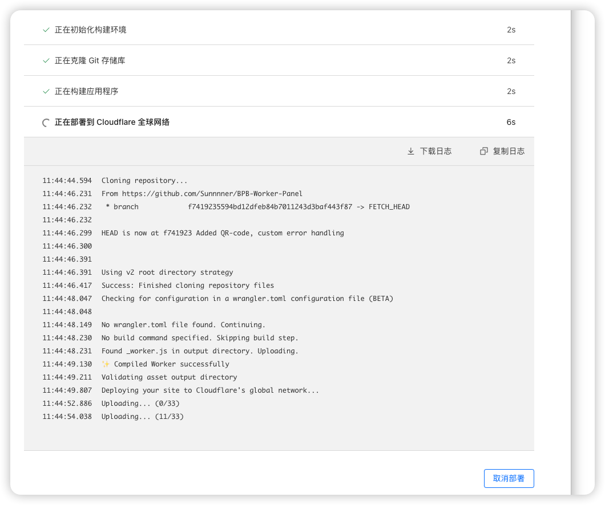

## 如何搭建BPB panel

- 首先将项目fork到你的github账号下`https://github.com/bia-pain-bache/BPB-Worker-Panel`

- 然后注册登录cloudflare账号, 按照以下图示操作

- 部署成功后构建kv空间, 按照以下图示操作，名称随意

- kv空间构建成功后返回概述页面，打开设置，点击函数，将kv空间进行绑定，注意变量名称一定是`bpb`，别的不起作用，然后点击保存后返回到部署页面，点击重新部署

- 点击查看详细信息

- 点击链接登录到你的panel，panel页面的地址为在你的.dev结尾的域名上添加`/panel`，示例`https://xxxxx.pages.dev/panel`

- 登录密码为admin，登录成功后点击`scan now`扫描ip地址，地址为`https://scanner.github1.cloud/` 或者`https://cloudflare-scanner.vercel.app/`哪个能用用哪个

- 复制一个ip，添加到你的panel的clean ips中,然后点击block ads,然后点击apply settings

现在你可以愉快的使用了